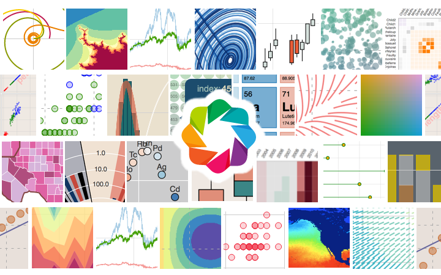

# Visualization with Bokeh

  

 This image is retrieved from <a href="https://docs.bokeh.org/en/latest/index.html">Bokeh organization</a>. 

## Objective & Purpose
The objective of this project is to design a notebook for people who are interested in creating maps via Bokeh. The purpose is to help readers learn Bokeh quickly through several practical examples. 

## How to run it locally
1. Clone this repo to your local machine.
2. Build the enviroment by following the instructions in the **environmental.yml** file.
3. Open the **index.ipynb** and run the code. 

## How to run it remotely
Click the badge below. This badge will bring you to the virtual enviroment boosted through the BinderHub and you can run the code in the **index.ipynb**. 

